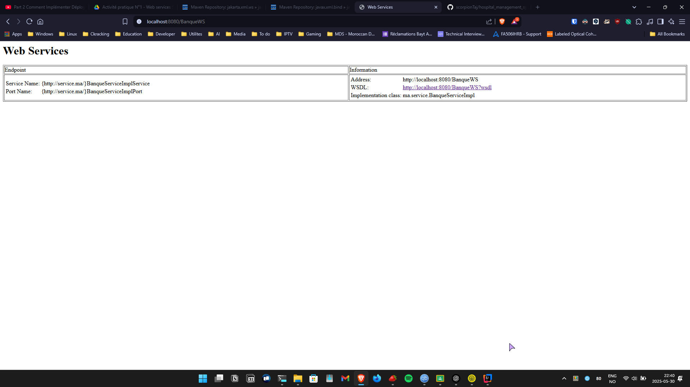
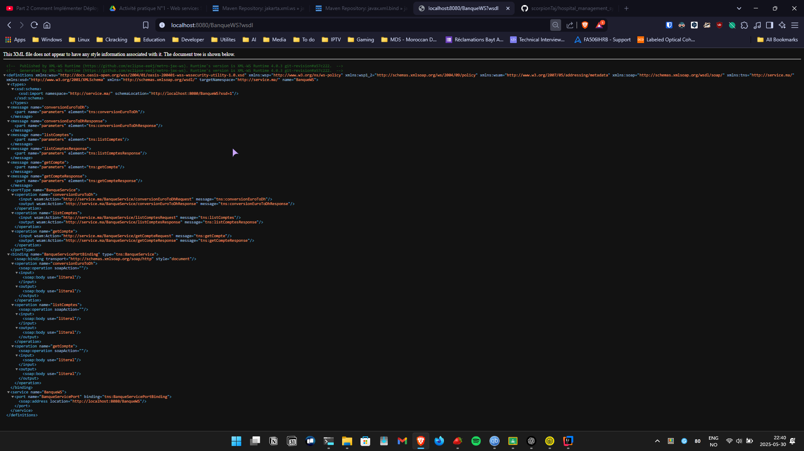
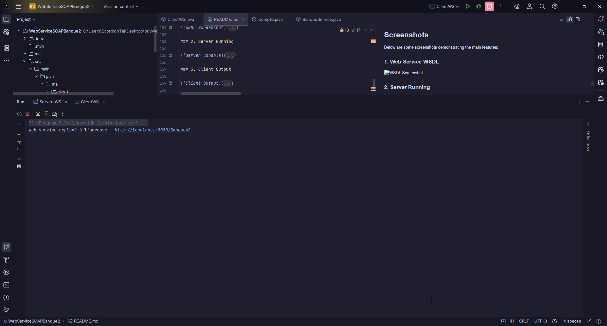
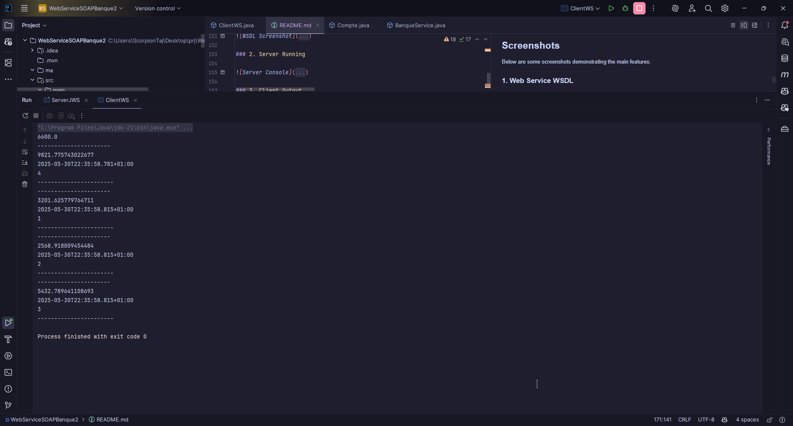
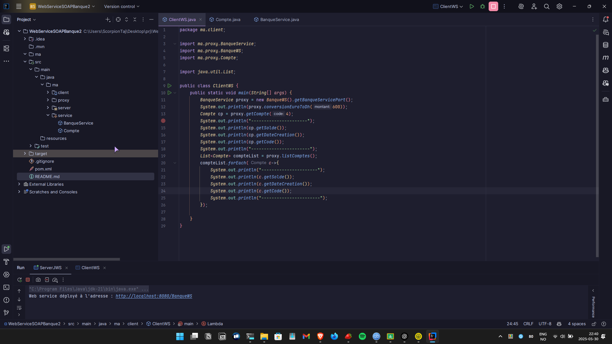
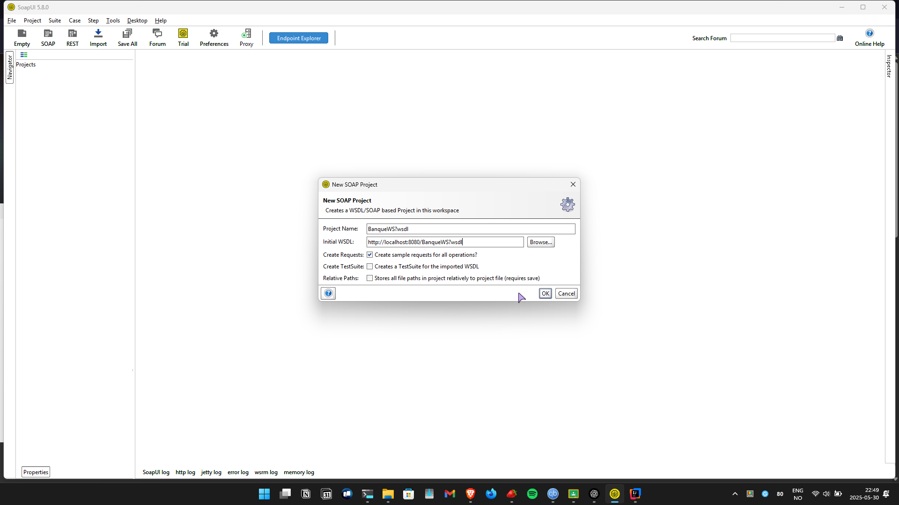
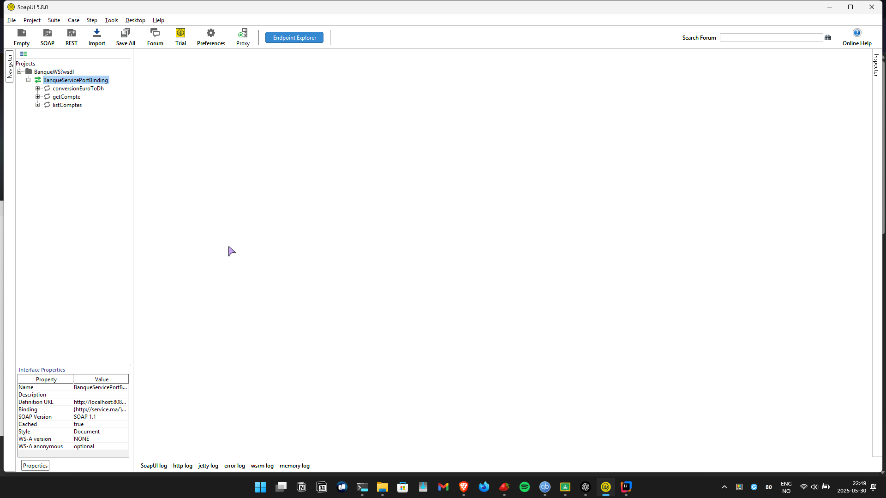
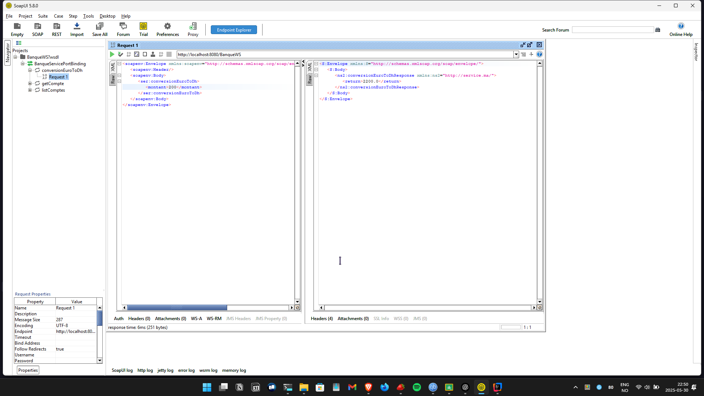
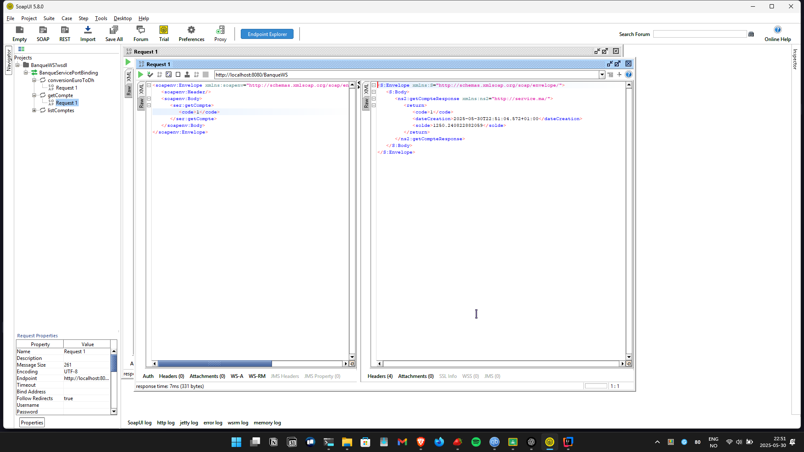
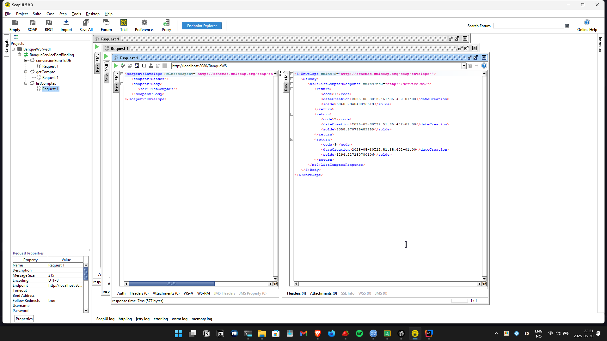

# SOAP Banque Web Service Project

A project to demonstrate and test SOAP web services using Jakarta EE (JAX-WS) for a simple banking system.

## Author

- **Name:** Tajeddine Bouhrim
- **Filière:** Master SDIA

---

## Table of Contents

- [Introduction](#introduction)
- [Features](#features)
- [Installation](#installation)
- [Important: wsimport Tool Compatibility](#important-wsimport-tool-compatibility)
- [Usage](#usage)
- [Technologies Used](#technologies-used)
- [Project Structure](#project-structure)
- [Setup Instructions](#setup-instructions)
- [Testing](#testing)
- [Screenshots](#screenshots)
- [License](#license)

---

## Introduction

This project is part of the Master SDIA program, for the course Distributed Systems and Middleware. It implements a simple SOAP web service for banking operations (account management and currency conversion) using Jakarta EE and JAX-WS.

---

## Features

- Currency conversion (Euro to Dirham)
- Retrieve a single account by code
- List all accounts
- Exposes SOAP endpoints using Jakarta EE (JAX-WS)
- Client application to consume the web service

---

## Installation

Clone the repository:

```sh
git clone https://github.com/scorpionTaj/WebServiceSOAPBanque2.git
```

Navigate to the project directory:

```sh
cd WebServiceSOAPBanque2
```

Install dependencies:

```sh
mvn clean install
```

---

## Important: wsimport Tool Compatibility

> **Note:**  
> Do **not** use the standard `wsimport` tool from the JDK, as it generates proxy files with `javax` packages, which are incompatible with Jakarta EE (`jakarta` packages).  
>  
> Instead, **download the Metro JAX-WS RI** (which includes the correct `wsimport` for Jakarta EE) from:  
> [https://eclipse-ee4j.github.io/metro-jax-ws/](https://eclipse-ee4j.github.io/metro-jax-ws/)  
>  
> After downloading and extracting, use the `wsimport` from the `bin` directory of Metro JAX-WS RI.

---

## Usage

### Start the Web Service

Run the server:

```sh
mvn exec:java -Dexec.mainClass="ma.server.ServerJWS"
```

The web service will be available at:  
`http://localhost:8080/BanqueWS?wsdl`

### Generate Client Proxy Classes

Use the Jakarta Metro `wsimport` tool **from Metro JAX-WS RI** (see above):

```sh
path\to\jaxws-ri\bin\wsimport.bat -keep -p ma.proxy -s src/main/java http://localhost:8080/BanqueWS?wsdl
```

### Run the Client

```sh
mvn exec:java -Dexec.mainClass="ma.client.ClientWS"
```

---

## Technologies Used

- Java 21+
- Jakarta EE (JAX-WS 4.x)
- Maven
- Metro JAX-WS RI
- IntelliJ IDEA

---

## Project Structure

- `ma/service/Compte.java`: Account entity (JavaBean)
- `ma/service/BanqueService.java`: Web service implementation
- `ma/server/ServerJWS.java`: Publishes the web service
- `ma/proxy/`: Generated client proxy classes
- `ma/client/ClientWS.java`: Client application

---

## Setup Instructions

### Prerequisites

- Java 21 or higher
- Maven
- Metro JAX-WS RI 4.x (for Jakarta wsimport)
- Any IDE (IntelliJ IDEA, Eclipse, VS Code, etc.)

### Steps

1. Clone the repository and open in your IDE.
2. Start the server (`ServerJWS`).
3. Generate client proxies using the Jakarta `wsimport`.
4. Run the client (`ClientWS`).

---

## Testing

The client application (`ClientWS`) demonstrates:

- Currency conversion
- Retrieving a single account
- Listing all accounts

### Testing with SoapUI

You can also test the SOAP web service functions using [SoapUI](https://www.soapui.org/):

1. Start the server (`ServerJWS`).
2. Open SoapUI and create a new SOAP project.
3. Enter the WSDL URL:  
   `http://localhost:8080/BanqueWS?wsdl`
4. SoapUI will generate requests for all available operations.
5. Test the following functions:
   - **convert**: Provide an amount in Euro and receive the converted value in Dirham.
   - **getCompte**: Provide an account code to retrieve account details.
   - **listComptes**: Retrieve the list of all accounts.
6. Inspect the SOAP requests and responses in SoapUI for validation.

---

## Screenshots

Below are some screenshots demonstrating the main features:

### 1. Web Service WSDL




### 2. Server Running



### 3. Client Output



### 4. Project Structure in IntelliJ IDEA



### 5. SoapUI Testing

#### a. SoapUI Project with Operations




#### b. Example: convert Operation Request/Response



#### c. Example: getCompte Operation Request/Response



#### d. Example: listComptes Operation Request/Response



---

## License

This project is licensed under the MIT License. See the `LICENSE` file for details.
